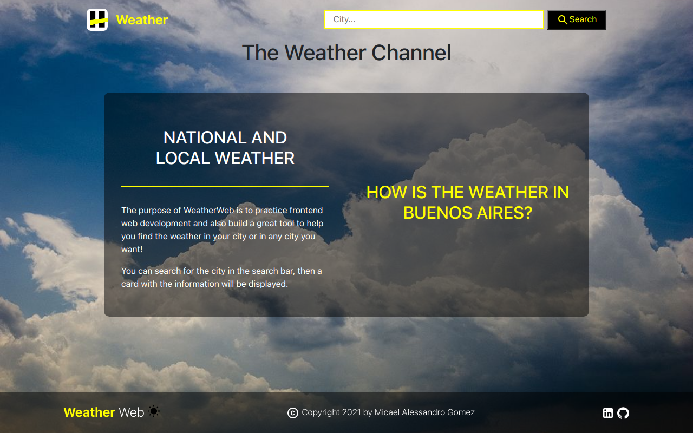

# THE WEATHER CHANNEL 

## Purpose
This project was developed within henry bootcamp, this was my first React application and the first time i called an API.

</img>

## Built with
- Javascript.
- React.js.
- Bootstrap.
- Css (Responsive - Media Query)
- Fetch

## Preyect
- https://clima-web.vercel.app/

## Available Scripts
**npm i** to install **npm start** to lunch on your localhost

Runs the app in the development mode.
Open http://localhost:3000 to view it in your browser.
